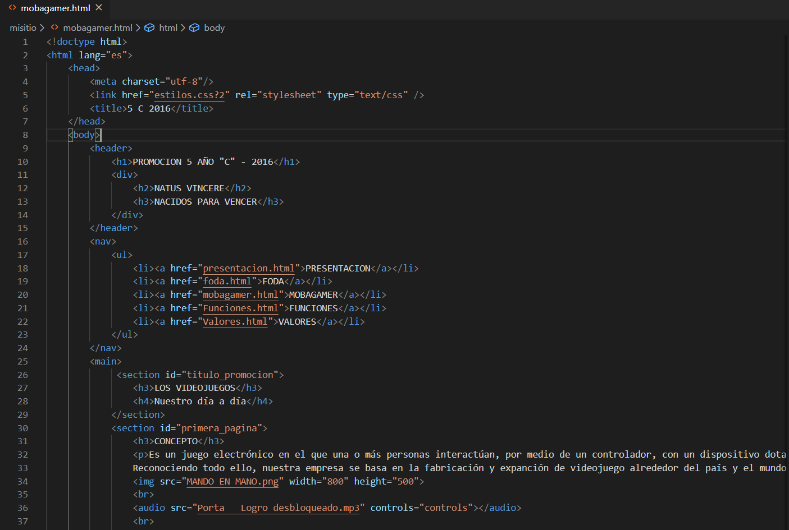
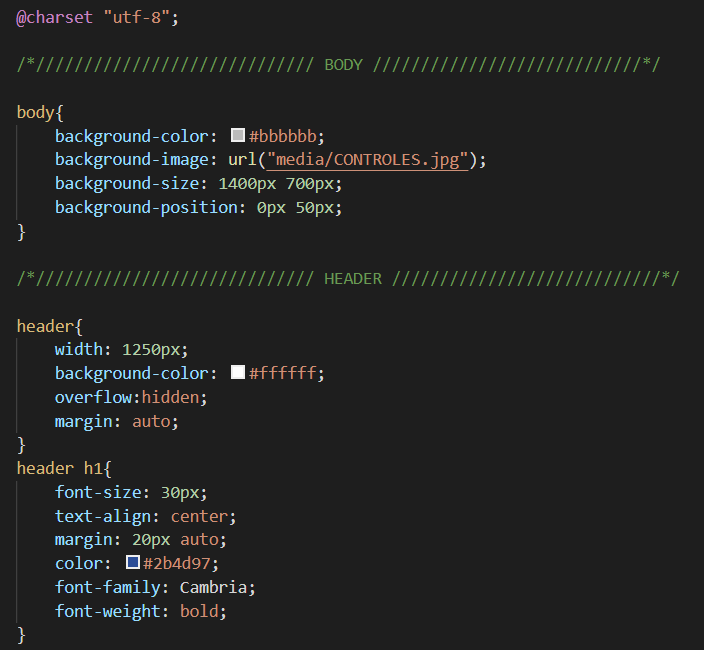
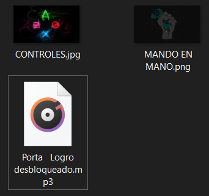
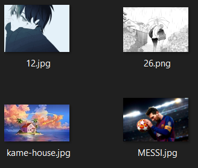

# INTENTO DE DESARROLLO HTML
En este repositorio encontrarás unos trabajos viejos y muy básicos de programación en html.
## CARPETA MISITIO
Encontrarás:
#### Archivo **HTML**

#### Archivo **CSS**

#### Carpeta de la multimedia

Una página simple desarrollada para un trabajo escolar. Podrá ver tanto **HTML** como **CSS** y la multimedia usada para el desarrollo de esta, de acá podrá sacar algunas líneas de código básicos que se necesitarán mucho. 
## CARPETA TEST
Encontrarás:
#### Archivo **HTML**, dentro también estará **SASS**(Casi lo mismo que el css).

#### Carpeta con las imágenes
